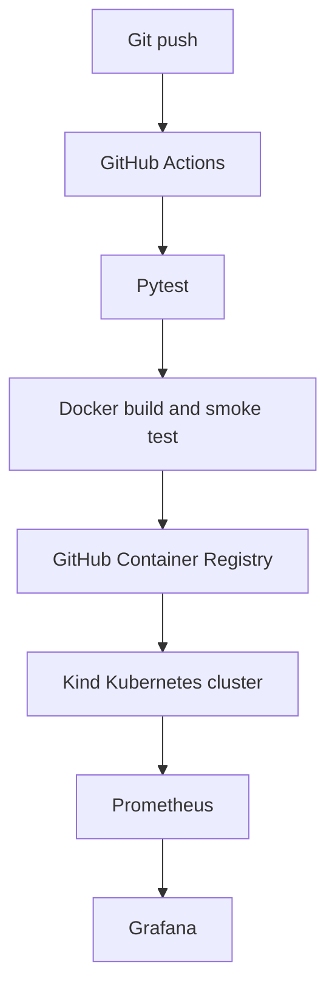

# DevOps Delivery Lab

[](https://github.com/AlexandraSirius/devops-delivery-lab/actions/workflows/ci.yml)

Практический DevOps-проект: доставка FastAPI-сервиса от исходного кода до Kubernetes с автоматическими тестами, публикацией Docker-образа и мониторингом.

## Architecture



## Implemented

- FastAPI application with health and metrics endpoints
- Automated tests with Pytest
- Docker image running as a non-root numeric user
- Container health check
- GitHub Actions CI pipeline
- Docker image publishing to GitHub Container Registry
- Smoke testing of the published image
- Kubernetes Deployment with two replicas
- Rolling updates and rollback testing
- Liveness and readiness probes
- CPU and memory requests and limits
- Restricted Kubernetes security context
- Prometheus metrics collection
- Provisioned Grafana datasource and dashboard

## Technology stack

- Python 3.14
- FastAPI
- Pytest
- Docker
- GitHub Actions
- GitHub Container Registry
- Kubernetes
- Kind
- Prometheus
- Grafana
- Git

## Application endpoints

| Endpoint | Purpose |
|---|---|
| `/` | Service name and deployed version |
| `/health` | Container and Kubernetes health check |
| `/metrics` | Prometheus metrics |

## Run tests

```bash
python -m pip install -r requirements.txt
python -m pytest -v
```

## Run with Docker

```bash
docker build -t devops-lab:local .
docker run --rm -p 8000:8000 -e APP_VERSION=local devops-lab:local
```

Check the application:

```bash
curl http://localhost:8000/
curl http://localhost:8000/health
curl http://localhost:8000/metrics
```

## CI/CD pipeline

Every push and pull request to `main` starts the GitHub Actions pipeline:

1. Checkout repository
2. Install Python dependencies
3. Run automated tests
4. Build the Docker image
5. Authenticate in GHCR using `GITHUB_TOKEN`
6. Publish immutable SHA and `latest` tags
7. Start the published image
8. Wait for the container health check
9. Execute an HTTP smoke test
10. Remove the temporary container

Published image:

```text
ghcr.io/alexandrasirius/devops-delivery-lab
```

## Deploy to Kubernetes

Create a local cluster:

```bash
kind create cluster --name devops-lab --config k8s/kind-config.yaml --wait 5m
```

Deploy the application:

```bash
kubectl apply -f k8s/app.yaml
kubectl rollout status deployment/devops-lab --namespace devops-lab --timeout=180s
```

Check resources:

```bash
kubectl get pods,service,endpointslices --namespace devops-lab --output=wide
```

Access the application:

```bash
kubectl port-forward --namespace devops-lab service/devops-lab 8081:80
```

## Monitoring

Deploy Prometheus and Grafana:

```bash
kubectl apply -f k8s/prometheus.yaml
kubectl apply -f k8s/grafana.yaml
```

Open Prometheus:

```bash
kubectl port-forward --namespace monitoring service/prometheus 9090:9090
```

Open Grafana:

```bash
kubectl port-forward --namespace monitoring service/grafana 3000:3000
```

The provisioned **DevOps Lab Overview** dashboard displays:

- available application instances;
- total HTTP requests;
- request rate grouped by endpoint;
- p95 request latency.

Grafana credentials are stored in a Kubernetes Secret and are not committed to Git.

## Security decisions

- Application runs with UID and GID `10001`
- `runAsNonRoot` is enabled
- Privilege escalation is disabled
- Linux capabilities are dropped
- `RuntimeDefault` seccomp profile is enabled
- Service account tokens are not mounted where unnecessary
- Credentials are kept outside the repository

## Troubleshooting performed

During implementation, the following problems were diagnosed and resolved:

- Docker daemon was unavailable until Docker Desktop started
- Kubernetes rejected a named non-root image user
- The image was changed to an explicit numeric UID and GID
- Slow first deployment was traced to image pulling inside the Kind node
- Failed CI behavior was tested and corrected
- Kubernetes rollout and rollback procedures were verified
- Prometheus service discovery was validated through EndpointSlices
- Port-forward reconnection after pod replacement was tested

## Useful diagnostic commands

```bash
kubectl get pods --all-namespaces
kubectl describe pod POD_NAME --namespace NAMESPACE
kubectl logs --namespace NAMESPACE deployment/DEPLOYMENT
kubectl rollout history deployment/DEPLOYMENT --namespace NAMESPACE
kubectl get endpointslices --namespace NAMESPACE
```
